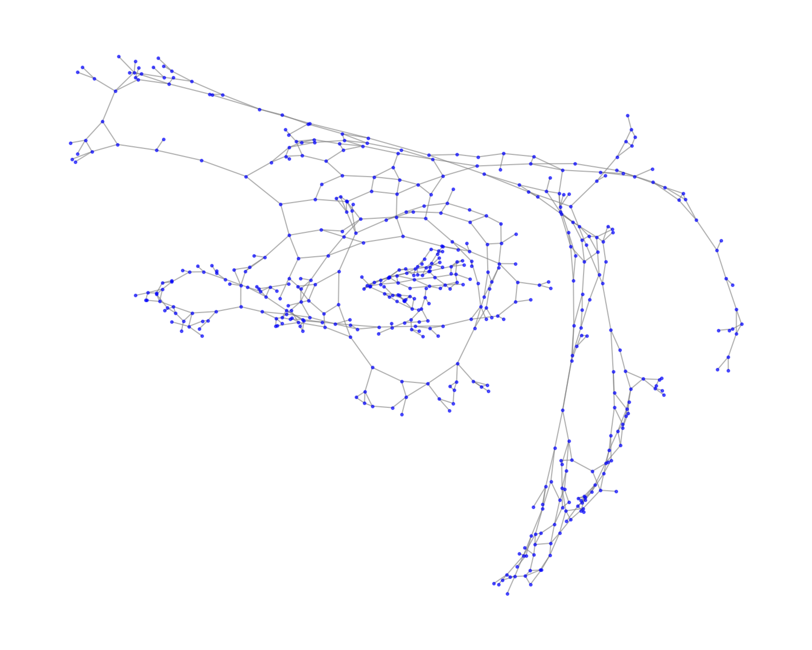

# 🚦 Real-Time Traffic Routing Using Dijkstra and A*

> Algorithm Analysis and Design
> Academic Year 2025/2026 (2nd Term)

---

## 📌 Project Overview

Traffic congestion is a major challenge in urban environments, leading to increased travel time and fuel consumption. This project models a road network as a weighted graph and applies two shortest-path algorithms to find the fastest and least congested route between two locations.

The two algorithms implemented and compared are:
- **Dijkstra's Algorithm** — guarantees the shortest path in weighted graphs with non-negative edges
- **A\* Algorithm** — uses heuristic information to guide the search more efficiently toward the destination

---

## 📂 Dataset

- **Name:** roadNet-CA
- **Source:** [Stanford SNAP](https://snap.stanford.edu/data/roadNet-CA.html)
- **Description:** Real road network of California where nodes represent road intersections and edges represent roads connecting them
- **Size:** ~1.9 million nodes, ~5.5 million edges

---

## 🛠️ Setup & Installation

### Requirements
- Python 3.x
- VS Code (or any Python IDE)

---

## 📊 Graph Visualization

The graph below shows a sample of 500 nodes from the road network:

- 🔵 **Blue dots** = Road intersections (nodes)
- ➖ **Gray lines** = Roads (edges)

---

## 🔍 Algorithms

### Dijkstra's Algorithm
- Explores all possible paths from the source
- Guarantees the shortest path
- Best for graphs without heuristic information

### A* Algorithm
- Uses heuristic (estimated distance to goal) to search smarter
- Faster than Dijkstra in most cases
- Best for real-time routing with known coordinates

---

## 📈 Performance Comparison

The project evaluates both algorithms under different traffic scenarios:
- ✅ Best case
- ✅ Average case
- ✅ Worst case

Metrics compared: **execution time** and **path optimality**

---

## 🧰 Technologies Used

- **Python** — main programming language
- **Pandas** — data cleaning and manipulation
- **NetworkX** — graph construction and algorithms
- **Matplotlib** — graph visualization

- **NetworkX** — graph construction and algorithms
- **Matplotlib** — graph visualization
